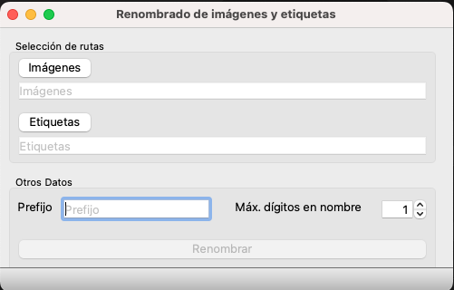

# Documentación de la Herramienta de Renombrado de Archivos

## Descripción
Esta herramienta está diseñada para renombrar archivos de imágenes y etiquetas asociadas, típicamente utilizadas en el entrenamiento de modelos de detección de objetos como YOLO. La herramienta asegura que los archivos de imágenes y sus etiquetas correspondientes tengan nombres coherentes y estén bien organizados.

##Necesidad de esta herramienta
Cuando descargamos un conjunto de imágenes para alimentar un modelo YOLO, estás imágenes tienen los nombres de archivo completamente no relacionados, ni secuenciados. Si descargamos imágenes con rostros, por ejemplo, una se llamará **keek3k3kl4mkw.jpg**, la siguiente se llamará simplemente **imagen.png**, y así. No hay una coherencia de nombres. Por supuesto, en un dataset real no son solo dos archivos de imágenes, que podríamos renombrar a mano. Son cientos o incluso miles de archivos. Eso hace que renombrarlas a mano sea una tarea imposible.

Ahora ya no tenemos que preocuparnos por esto. Simplemente cargamos nuestro dataset de imágenes en una aplicación como  [Makesense](https://www.makesense.ai) o [CVAT](https://www.cvat.ai), por nombrar algunos, y creamos las eirquetas para las imágenes. Después guardamos las etiquetas en el correspondiente directorio. Estos archivos de etiquetas también tendrán los nombres "peregrinos" de los archivos de imagen.
Esta herramienta se encarga de recorrer los dos dierctorios que le digamos, el de imágenes y el correspondiente de etiquetas, y renombrar los archivos según un patrón. Nosotros indicamos un prefijo, y un número máximo de dígitos para los nombres, y nos renombrará las imáagenes y las etiquetas según ese patrón. Por ejemplo, las imagenes se convretirán en **patron_0001.jpg**, **patron_0002.png**, y, así sucesivamente. Por supuesto, para mantener la coherencia y la correlación entre imágenes y etiquetas, las etiquetas se renombreán como **patron_0001.txt**, **patron_0002.txt**, y así sucesivamente.

## Características
- **Selección de Directorios:** Permite al usuario seleccionar un directorio que contenga imágenes y otro con etiquetas.
- **Renombrado Automático:** Renombra archivos de imágenes y etiquetas de manera secuencial basándose en un prefijo proporcionado por el usuario.
- **Mantenimiento de Extensiones:** Preserva las extensiones originales de los archivos de imágenes y etiquetas.
- **Sincronización de Etiquetas:** Asegura que cada imagen tenga su archivo de etiqueta correspondiente con el mismo nombre base.

## Cómo Usar
1. **Seleccionar Directorios:**
   - Seleccione el directorio que contiene las imágenes.
   - Seleccione el directorio que contiene los archivos de etiquetas.

2. **Configurar Opciones de Renombrado:**
   - Ingrese un prefijo para los nombres de los archivos.
   - Especifique el número de dígitos a usar en la secuencia numérica.

3. **Iniciar el Proceso de Renombrado:**
   - Haga clic en el botón "Renombrar" para comenzar el proceso.

## La Interfaz Gráfica de Usuario (GUI)

## Requisitos
- Sistema operativo MacOS, Windows o Linux
- Python versión 3.x
- Dependencias:
	- PyQT6
	- PySide6

Para facilitar la instalación de dependencias se incluye un archivo requiremente.txt

## Instalación y Configuración
Para instalar la herramienta se aconseja seguir el siguiente protocolo:
- Crear un directorio en el disco, donde se decargará el repositorio de GitHub.
- Crear un entorno virtual para instalación de las dependencias. Estas se instalarán tecleando en la terminal:
		pip install -r requirements.txt
- Ejecutar la herramienta con:
		python -m main

## Soporte
Para información de soporte o resolución de dudas, ponerse en contacto con jquijado@gmail.com. Como alternativa más rápida, ChatGPT.
