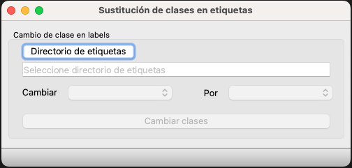

# Documentación de la Herramienta de Cambio de Clases en Archivos de Etiquetas

## Descripción
Esta herramienta facilita el proceso de cambio de clases en archivos de etiquetas, utilizados en sistemas de detección de objetos como YOLO. Permite al usuario seleccionar una clase existente y reemplazarla por otra en múltiples archivos de etiquetas de forma eficiente y precisa.

##**NECESIDAD**
Tenemos una colección de archivos de etiquetas para YOLO. En todos estos archivos cada etiqueta empieza con un indicador de clase, correspodiente a la posición que ocupa dicha clase en el archivo **labels.txt**. Ahora supongamos que ese archivo se modifica, por añadir, por ejemplo, otra clase encima de la original. En los archivos de etiqueta hay que cambiar todas las referencias a la clase para que apunten a la nueva. Ese cambio debe hacerse en todos los archivos de etiquetas, incluyendo auqellos que tengan más de una etiqueta.
Por supuesto, hacer esto de forma manual, es un proceso terriblemente lento y propenso a errores que inutilizarían nuestro conjunto de etiqueetas.

##**SOLUCIÓN**
Hemos creado una sencilla aplicación en la que podemos seleccionar el directorio donde están las etiquetas. Una vez seleccionado, la aplicación lee el archivo labels.txt y nos muestra la lista de las clases disponbles.
A continuación dseleccionamos la clase que tienen actualmente los ficheros de etiqueta, y la que debemos poner en cambio. Pulsamos el botón de ejecución y la apliccación se ocupa de cambiar la clase en todos los archivos de etiqueta, rápidamente y sin errores.

##**La GUI de la aplicación**

## Requisitos de uso
Para usar la herramienta es necesario tener instalada la siguiente configurción:
- Sistema operativo MacOS, Windows o Linux
- Python 3.11
- Las dependencias indicadas en **requirements.txt**

## Instalación
Una vez descargada la herramienta de GittHub es necesario almacenarla en un directorio del disco.
- Se creará un entorno virtual en el directorio.
- Se instalarán las dependenccias con:
		pip install -r requirementes.txt
Esto se hará una sóla vez

- Deespués se pondrá la herramienta en marcha con:
		python -m main

## Características
- **Selección de Directorio de Etiquetas:** Permite seleccionar el directorio que contiene los archivos de etiquetas.
- **Selección de Clases para Cambiar:** Ofrece listas desplegables para elegir la clase a cambiar y la clase por la que se va a reemplazar.
- **Procesamiento Automático:** Cambia las clases seleccionadas en todos los archivos de etiquetas del directorio elegido.

## Cómo Usar
1. **Seleccionar el Directorio de Etiquetas:**
   - Utilice el botón proporcionado para seleccionar el directorio que contiene los archivos de etiquetas (formato `.txt`).

2. **Elegir Clases para Cambiar:**
   - En las listas desplegables, seleccione la clase que desea cambiar y la clase por la que desea reemplazarla.

3. **Iniciar el Cambio de Clases:**
   - Haga clic en el botón "Cambiar clases" para aplicar los cambios en todo el directorio.

## Instalación y Configuración
Instrucciones sobre cómo instalar y configurar la herramienta.

## Soporte
Para dudas o aclaraciones contactar con jquijado@gmail.com
